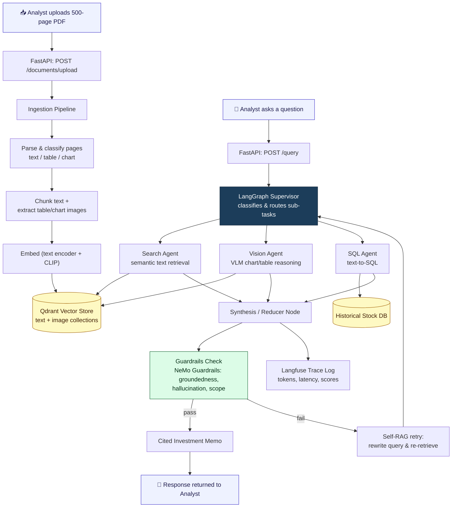
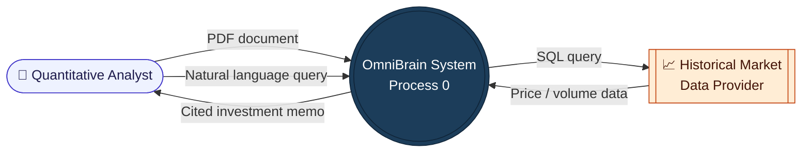
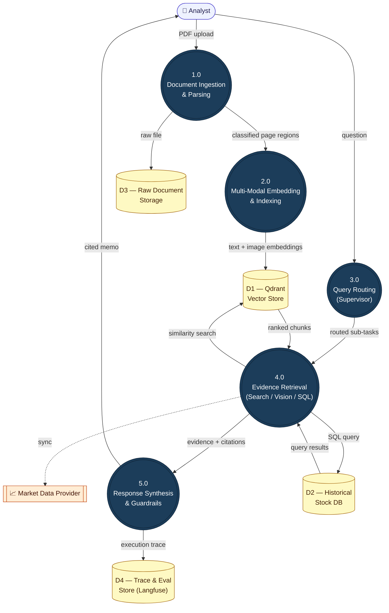
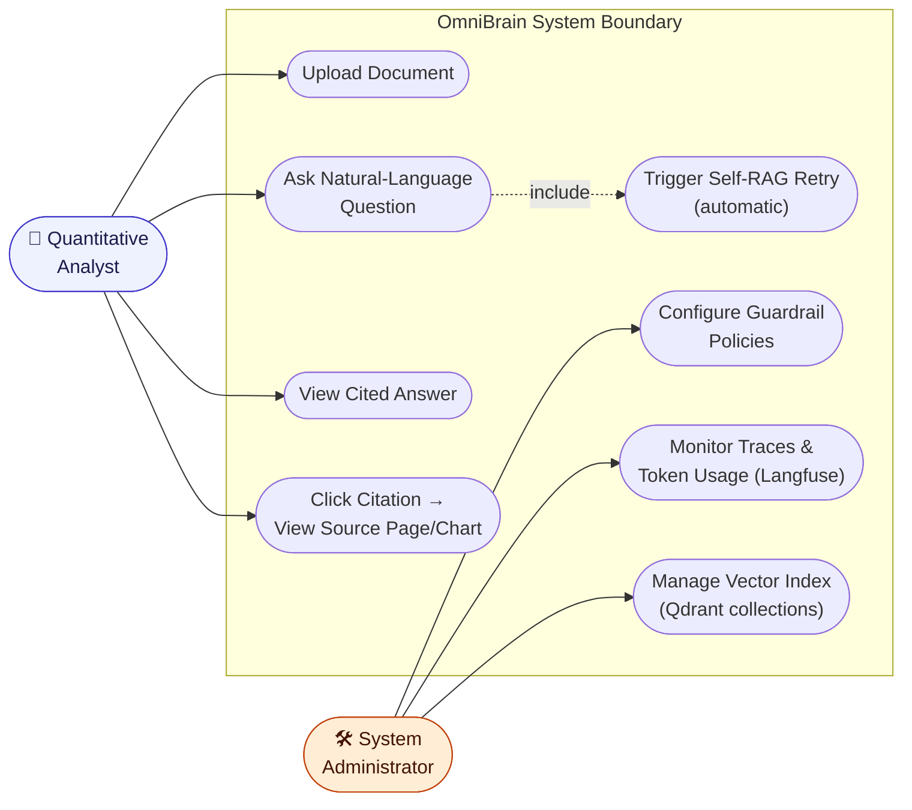
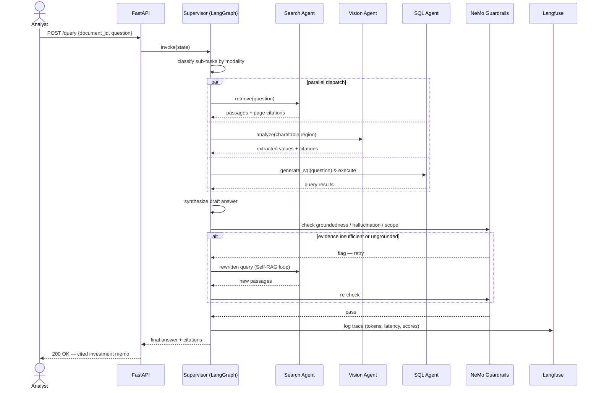
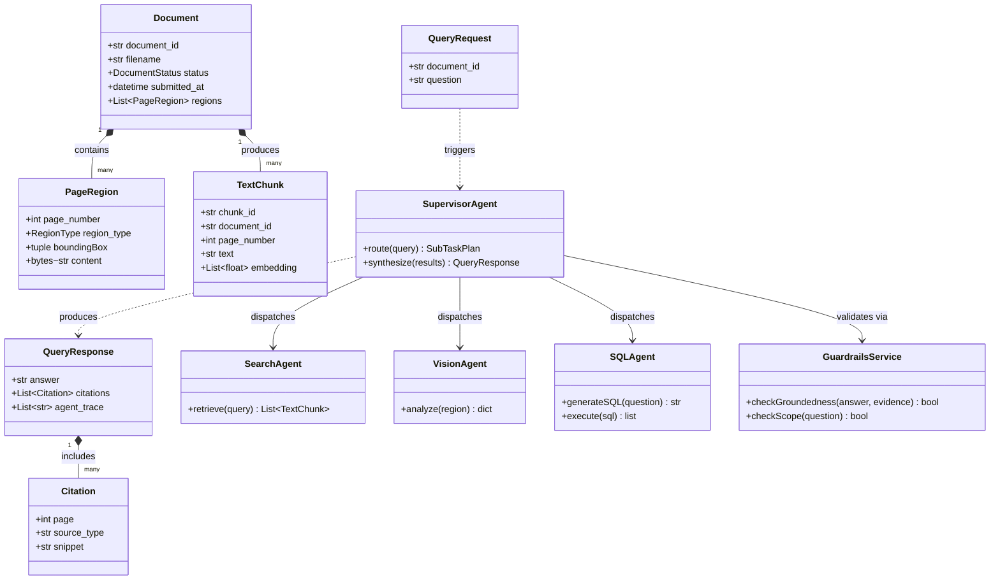
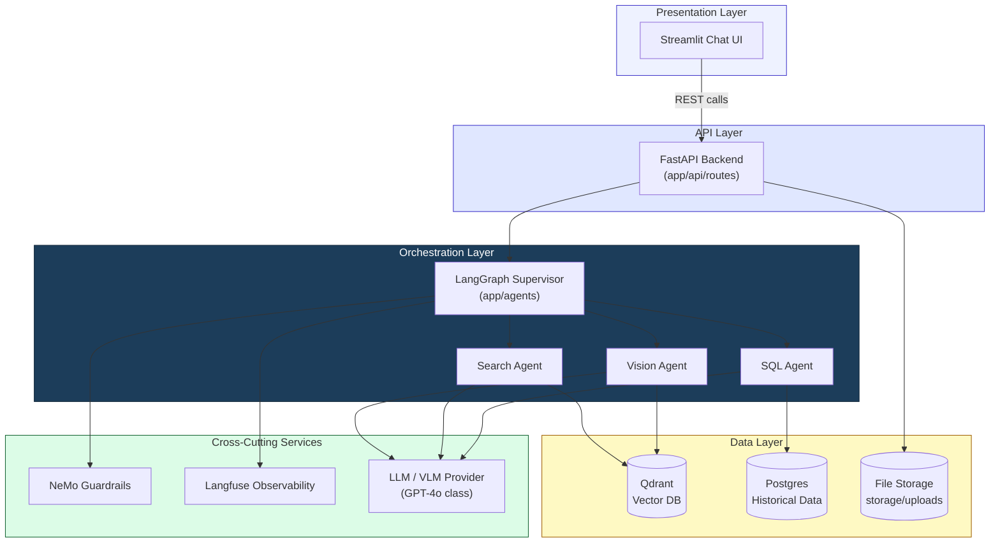
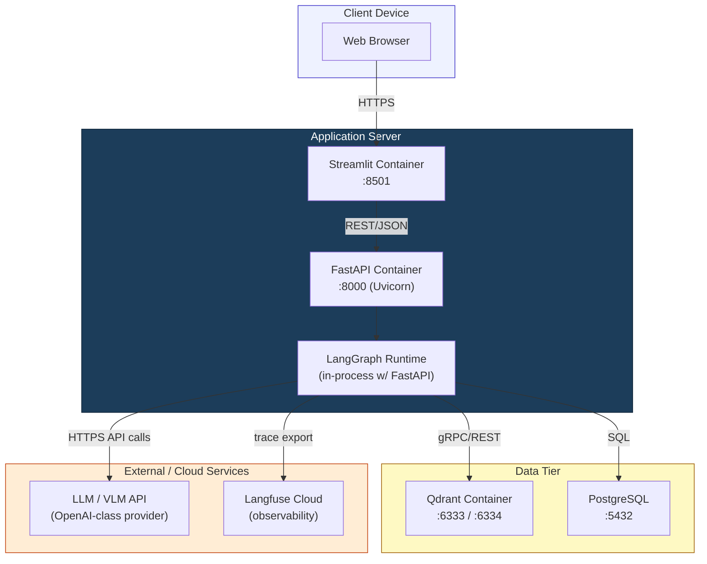

# OmniBrain — System Diagrams

Flow diagram, Data Flow Diagrams (Level 0 & 1), and UML diagrams (Use Case, Sequence, Class, Component, Deployment) for the OmniBrain Agentic Multi-Modal RAG Orchestrator...

All diagrams are written in [Mermaid](https://mermaid.js.org/) and render automatically on GitHub — no image files required.

---

## 📑 Table of Contents

1. [End-to-End System Flow Diagram](#1-end-to-end-system-flow-diagram)
2. [Data Flow Diagram — Level 0 (Context)](#2-data-flow-diagram--level-0-context)
3. [Data Flow Diagram — Level 1](#3-data-flow-diagram--level-1)
4. [UML Use Case Diagram](#4-uml-use-case-diagram)
5. [UML Sequence Diagram — Query Lifecycle](#5-uml-sequence-diagram--query-lifecycle)
6. [UML Class Diagram](#6-uml-class-diagram)
7. [UML Component Diagram](#7-uml-component-diagram)
8. [UML Deployment Diagram](#8-uml-deployment-diagram)

---

## 1. End-to-End System Flow Diagram

Covers both phases of the system: offline document ingestion and the live query-answering flow.

---

## 2. Data Flow Diagram — Level 0 (Context)

The system treated as a single process, showing only external entities and the data crossing the system boundary.

---

## 3. Data Flow Diagram — Level 1

Process 0 decomposed into its five major sub-processes, with data stores shown as open cylinders.

---

## 4. UML Use Case Diagram

Mermaid has no native use-case shape, so actors and use cases are represented with person nodes and stadium (rounded) nodes, grouped by system boundary.

---

## 5. UML Sequence Diagram — Query Lifecycle

Traces a single `/query` request through the Supervisor, the three specialist agents, guardrails, and observability logging.

---

## 6. UML Class Diagram

Core domain model spanning the ingestion schemas (`app/models`, `app/ingestion`) and the agent layer (`app/agents`).

---

## 7. UML Component Diagram

Logical software components and the interfaces between them (approximated with grouped subgraphs, since Mermaid has no native component-diagram type).

---

## 8. UML Deployment Diagram

Physical/logical deployment nodes for a typical local-dev or containerized environment.

---

## Notes

- All diagrams render natively when this file is viewed on GitHub — no export step needed.
- To preview locally before committing, paste any code block into the [Mermaid Live Editor](https://mermaid.live).
- The DFDs and Component/Deployment diagrams reflect the **target architecture** from the Week-wise Development Plan; several data flows (Vision Agent, SQL Agent, Guardrails, Langfuse) will only be fully live once their respective weeks land — see `OmniBrain_Day2_Scaffold_Explained.pdf` for what's implemented as of Day 2.
