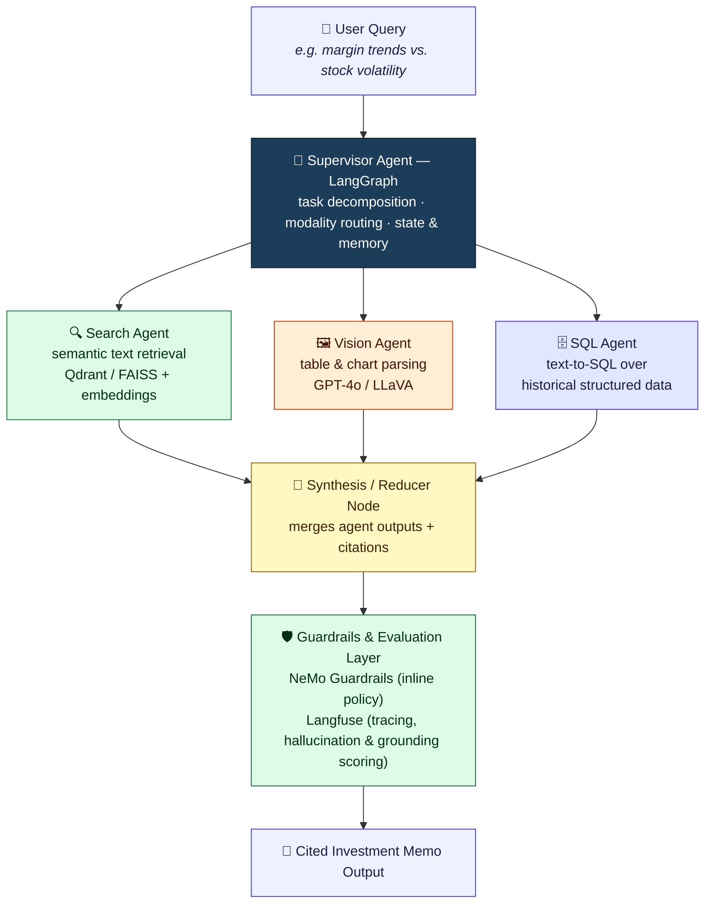
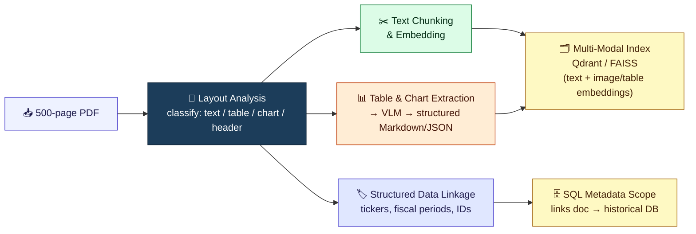
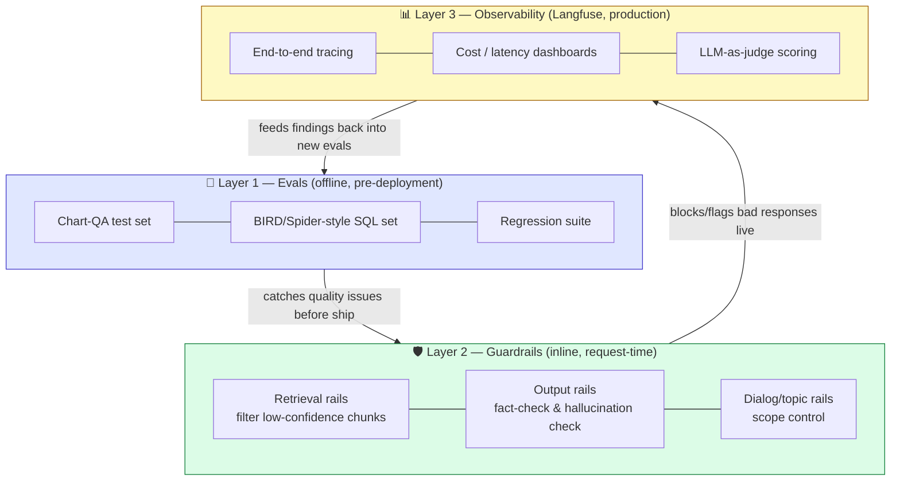

# 🧠 OmniBrain: An Agentic Multi-Modal RAG Orchestrator for Enterprise Document Intelligence

### A Research and Technical Design Documents

**Domain:** Large Language Models (LLMs) & Agentic AI
**Prepared:** July 2026

---

## 📑 Table of Contents

1. [Abstract](#1-abstract)
2. [Problem Statement and Motivation](#2-problem-statement-and-motivation)
3. [Literature and Technology Landscape Review](#3-literature-and-technology-landscape-review)
4. [System Architecture](#4-system-architecture)
5. [Proposed Technology Stack](#5-proposed-technology-stack)
6. [Evaluation Methodology](#6-evaluation-methodology)
7. [Anticipated Challenges and Limitations](#7-anticipated-challenges-and-limitations)
8. [Future Scope](#8-future-scope)
9. [Conclusion](#9-conclusion)
10. [Selected References](#10-selected-references)

---

## 1. Abstract

OmniBrain is a proposed agentic, multi-modal Retrieval-Augmented Generation (RAG) system designed to overcome the two failure modes that cripple standard RAG pipelines in real-world enterprise settings: (1) the inability to reason over non-textual content such as financial tables, embedded charts, and scanned figures, and (2) the inability to perform multi-step reasoning that spans heterogeneous data silos (unstructured documents, structured databases, and visual assets). OmniBrain addresses both problems by replacing the conventional "single retriever → single generator" pipeline with a graph-structured team of specialized agents — a Search Agent, a Vision Agent, and a Text-to-SQL Agent — coordinated by a LangGraph supervisor. The system is grounded by a multi-modal vector store (Qdrant/FAISS) holding both text and CLIP-based image embeddings, augmented by a Vision-Language Model (VLM) for chart and table reasoning, and wrapped in an observability and guardrails layer (Langfuse + NeMo Guardrails) that enforces grounding, monitors for hallucination, and produces auditable, cited outputs. This document presents the problem motivation, a review of the current technical landscape, a full architectural design, module-by-module specifications, an evaluation methodology, anticipated challenges, and a roadmap for implementation.

---

## 2. Problem Statement and Motivation

### 2.1 Why standard RAG breaks down

A conventional RAG pipeline chunks a document into text passages, embeds them into a single vector space, retrieves the top-k passages for a query, and stuffs them into an LLM prompt. This design implicitly assumes that all the information a user needs is expressible as extractable text. In practice, that assumption fails in at least four common ways, particularly in dense enterprise documents such as 10-K filings, investment memos, and quarterly earnings decks:

- **Scanned or image-only content.** Older filings, exhibits, and correspondence may exist only as pixel data; a text parser returns an empty string and the information is silently lost.
- **Tables and financial statements.** Naïve chunking destroys the row/column relationships in a balance sheet or cash-flow table, so numbers get detached from their labels and units.
- **Embedded charts and graphs.** A revenue trend chart or a stock price graph carries information that cannot be extracted as text at all — it must be visually interpreted.
- **Cross-silo reasoning.** A single query like "How did the reported EBITDA margin compare to the company's historical stock performance during the same quarter?" cannot be answered from unstructured text alone; it requires joining a narrative claim in the PDF with structured, queryable historical data (e.g., a stock price time series in a SQL database).

A single-retriever, single-generator RAG architecture has no mechanism for routing between these different evidence types, and no mechanism for verifying that the final answer is actually grounded in what was retrieved — which is why standard RAG systems remain prone to hallucination on multi-modal, multi-source enterprise workloads.

### 2.2 The shift toward agentic RAG

The current direction in both industry and research is to decompose the RAG problem into specialized sub-tasks handled by cooperating agents rather than a single monolithic pipeline. Recent research explicitly frames multi-modal RAG as necessary once documents exceed what a model's context window can hold and once they interleave text, tables, and charts — retrieval is used to select only the evidence that matters rather than forcing a model to read everything at once. In the financial domain specifically, recent benchmark work (e.g., FinRAGBench-V and MultiFinRAG) has emphasized that financial question answering requires jointly modeling narrative text, tables, and figures together, and that visual citation — pointing back to the exact chart or table cell that supports an answer — is critical for the kind of transparency and auditability that financial decision-making demands. This is precisely the gap OmniBrain is designed to fill.

### 2.3 Use case walkthrough

A quantitative analyst uploads a 500-page corporate financial PDF (e.g., a 10-K annual report with embedded revenue charts, balance-sheet tables, and MD&A narrative). The analyst asks: *"Summarize the company's Q3 margin trends, compare them to the prior two years, and relate them to the stock's recent volatility."* OmniBrain's supervisor agent decomposes this into sub-tasks: table extraction and normalization (Vision Agent), semantic narrative retrieval (Search Agent), and a historical price/volatility query (SQL Agent). The individual agent outputs are merged, cross-checked against the retrieved evidence by the guardrails layer, and synthesized into a cited investment memo, with every quantitative claim traceable to a specific page, table cell, or database row.

---

## 3. Literature and Technology Landscape Review

### 3.1 Agentic orchestration frameworks

LangGraph has become a widely adopted standard for building stateful, graph-based multi-agent systems, reportedly seeing tens of millions of monthly downloads and production use at large enterprises. Its core primitives are directly relevant to OmniBrain's design: a persistent **state dictionary** shared across nodes, **checkpointing** that snapshots state at each step (enabling recovery if a workflow is interrupted mid-execution), and a graph topology of **router**, **specialist agent**, and **supervisor/reducer** nodes. Among the topologies LangGraph supports — network, supervisor, and hierarchical — the **supervisor pattern** is the recommended choice for a small, fixed team of 3–5 specialists (in OmniBrain's case: Search, Vision, and SQL agents), since a fully peer-to-peer "network" topology becomes difficult to control at that scale, while a multi-level "hierarchy" is unnecessary overhead. A widely used cost-optimization pattern is to reserve a stronger reasoning model (e.g., GPT-4o-class or Claude Opus-class) for the supervisor's routing decisions, while using smaller, cheaper models for individual worker agents that only need to execute a narrow task.

### 3.2 Multi-modal retrieval

Three architectural patterns currently dominate multi-modal document retrieval: **caption-and-index** (a VLM generates a text caption for each image/chart, which is then embedded like ordinary text — simplest but prone to "caption drift," where hallucinated caption details pollute the index), **unified vision embeddings** (models such as Cohere Embed 4 or Voyage's multimodal embeddings project images and text into a shared vector space), and **page-as-image with late interaction** (ColPali/ColQwen-style models that embed a full rendered page as an image and perform fine-grained patch-level matching against the query). CLIP-style embeddings remain a standard, cost-effective choice for image-text similarity search, particularly when paired with a vector database such as **Qdrant** or **FAISS** that supports hybrid text+image collections. Known failure modes to design against include **modality leakage** (visually similar but semantically irrelevant pages being retrieved, e.g., two pages sharing the same template) and **dominant-modality bias** (textual matches outscoring visual matches unless fusion weights are explicitly tuned).

### 3.3 Vision-Language Models for chart and table reasoning

VLMs such as GPT-4o and open alternatives like LLaVA are used to extract and reason over the visual structure of tables and charts that plain-text parsers cannot handle — for example, by converting a chart or table image into a structured Markdown or JSON representation that can then be merged back with the surrounding textual context. This "convert visual structure to text, then integrate" approach is a documented technique specifically proposed for financial-document RAG. However, VLMs are also known to hallucinate specific numeric values when reading charts, which is why chart-QA style evaluation sets and explicit bounding-box or cell-level citations are recommended safeguards rather than trusting VLM outputs unconditionally.

### 3.4 Text-to-SQL agents and the enterprise accuracy gap

A critical and often underestimated risk area for OmniBrain's SQL Agent is the gap between academic text-to-SQL benchmarks and real enterprise performance. On the original Spider benchmark, frontier models exceed 90% execution accuracy; on **Spider 2.0**, which reflects realistic enterprise schemas, multi-step queries, and large multi-thousand-column databases, even frontier models drop to roughly **17–21% accuracy**. Independent measurements tell the same story: Snowflake's internal evaluation of GPT-4o on 150 real business-intelligence questions found only about 51% accuracy — meaning roughly every second query was wrong while still looking syntactically valid and executing without error, which is the most dangerous kind of failure because there is no runtime signal that anything went wrong. The literature converges on one mitigation: adding an explicit **semantic layer** or knowledge-graph representation of the schema (rather than letting the LLM interpret raw table/column names) can move accuracy from the 15–50% range up into the 90%+ range. This directly informs OmniBrain's SQL Agent design (Section 4.4).

### 3.5 Evaluation, observability, and guardrails

**Langfuse** is a widely used open-source LLM observability platform that treats each model call as a structured "generation" — capturing prompt, completion, token counts, latency, and cost — nested inside traces and sessions, so that a multi-agent workflow's full execution path can be reconstructed after the fact. It supports LLM-as-a-judge scoring, dataset curation, and prompt version management, but by itself it is a *logging and scoring* layer rather than a request-time firewall. **NeMo Guardrails**, NVIDIA's open-source toolkit, complements this by acting as an inline **runtime policy layer**: it defines five categories of rails — input, dialog, retrieval, execution, and output — using a domain-specific language called Colang. Its retrieval rails can filter or drop retrieved chunks that match disallowed patterns before they ever reach the generator, and its output rails include self-check fact-checking and hallucination-detection flows specifically intended for RAG applications. The current best-practice pattern in the field is layered: **evaluations** catch quality problems offline before deployment, **guardrails** intercept problems inline at request time, and **observability** (Langfuse) captures what actually happened in production so that failures missed by the first two layers can still be found and fixed. OmniBrain adopts this three-layer model directly.

---

## 4. System Architecture

### 4.1 High-level design

OmniBrain follows a **supervisor-orchestrated, graph-based multi-agent architecture**. A single LangGraph state graph maintains shared conversational and task state; a supervisor node inspects the incoming query (and, once ingestion has occurred, the internal structure of the retrieved resource — is it a scanned image, a table, a narrative passage, or a request for time-series data?) and routes to one or more specialist nodes. Specialist outputs are written back into shared state, and a reducer/synthesis node merges them into a final, cited response, which then passes through the guardrails layer before being returned to the user.

**Legend:** the Supervisor fans work out to whichever specialist agents a query needs (in parallel where sub-tasks are independent, sequentially where one agent's output feeds another), the Reducer merges results with citations attached, and every output passes through the Guardrails/Evaluation layer before reaching the user.

### 4.2 Ingestion pipeline (offline / document-load time)

1. **Document parsing & layout analysis** — the 500-page PDF is split by page; layout-aware parsers (e.g., Docling/Unstructured-style tools) classify each region as narrative text, table, chart/image, or header/footer.
2. **Text chunking & embedding** — narrative text is chunked (semantically, not purely by token count) and embedded into the text collection.
3. **Table & chart extraction** — table and chart regions are cropped and passed to the Vision Agent's VLM, which converts them into structured Markdown/JSON, which is then embedded alongside a CLIP embedding of the raw image for cross-modal similarity search.
4. **Structured data linkage** — where the document references tickers, fiscal periods, or company identifiers, these are extracted as metadata used later to scope the SQL Agent's queries to the correct historical dataset.
5. **Indexing** — all embeddings (text and image/table) are written into the multi-modal Qdrant/FAISS collection, with metadata (page number, bounding box, section heading) preserved for later citation.

### 4.3 Agentic Orchestrator (LangGraph) — Module Detail

The orchestrator is the control plane of OmniBrain. Its responsibilities, aligned with the architecture patterns reviewed in Section 3.1, are:

- **State management** — a single shared state object (query, retrieved evidence per modality, intermediate agent outputs, citation list, guardrail flags) flows through every node, avoiding the "lost context between agent calls" problem common in looser multi-agent frameworks.
- **Routing logic** — the supervisor classifies each sub-task by required modality (text/table/chart/structured-data) and dispatches to one or more specialists in parallel where sub-tasks are independent, or sequentially where one agent's output feeds another (e.g., the SQL Agent needs the fiscal period identified by the Search Agent first).
- **Checkpointing & durability** — state is checkpointed at each node transition so that a failure partway through a long-running 500-page analysis does not require restarting from scratch.
- **Memory** — short-term memory (current session state) is distinguished from longer-term memory (e.g., a cache of previously extracted tables for the same document), reducing redundant VLM calls on repeated queries against the same corpus.
- **Cost-tiered model selection** — following the pattern noted in Section 3.1, the supervisor uses a stronger reasoning-capable model for routing/synthesis decisions, while individual specialist agents use smaller, cheaper models tuned to their narrow task.

### 4.4 Specialist Agents

**Search Agent (semantic retrieval).** Performs dense retrieval over the text collection in Qdrant/FAISS, optionally combined with a reranking step, to surface the narrative passages most relevant to the query. Returns passages with page-level provenance for later citation.

**Vision Agent (VLM-based table/chart reasoning).** Given a query that references a specific figure, table, or trend, the Vision Agent retrieves the relevant image/table embeddings via CLIP similarity search, then invokes the VLM (GPT-4o/LLaVA-class) to answer the sub-question against the actual pixel content rather than a lossy caption. To mitigate the numeric-hallucination risk noted in Section 3.3, the agent is designed to (a) request explicit cell/axis-level references from the VLM rather than free-form summaries, and (b) cross-check any extracted number against the guardrails layer's fact-checking rail before it is allowed into the final synthesis.

**Text-to-SQL Agent (structured historical data).** Given the enterprise accuracy gap documented in Section 3.4, this agent is *not* designed as a naive "schema-in-prompt" text-to-SQL call. Instead it follows the two-stage pattern shown to be effective in current agentic text-to-SQL research: (1) a **routing stage** that selects the correct database/table given the natural-language question, and (2) a **schema-retrieval stage** that pulls only the relevant table/column definitions from a vector store of schema documentation before query generation — effectively giving the SQL Agent its own lightweight, schema-scoped RAG step rather than relying on the LLM's raw guess at column meaning. Generated SQL is executed against a read-only replica, and results are validated for row-count sanity and unit consistency before being handed back to the supervisor.

### 4.5 Multi-Modal Retrieval Layer (Qdrant / FAISS)

The vector store holds (at minimum) two collections — text-chunk embeddings and image/table embeddings (CLIP or an equivalent vision encoder) — with shared metadata schemas so that a single query can be fused across both. Given the modality-bias risk noted in Section 3.2, fusion (e.g., Reciprocal Rank Fusion) weights between text and image results should be tunable rather than fixed, since text results otherwise tend to dominate.

### 4.6 Evaluation & Guardrails Layer

OmniBrain adopts this three-layer reliability pattern from Section 3.5:

- **Evals (offline)** — a held-out set of question/answer pairs (including chart-QA style questions to specifically test the Vision Agent, and BIRD/Spider-style SQL questions to test the SQL Agent) is used to regression-test the pipeline before any change is deployed.
- **Guardrails (inline, NeMo Guardrails)** — retrieval rails filter out low-confidence or off-scope retrieved chunks before generation; output rails run self-check fact-checking and hallucination-detection flows against the retrieved evidence, and topic/dialog rails keep the agent from answering outside the scope of the loaded financial documents (e.g., refusing unrelated investment-advice requests it isn't authorized to make).
- **Observability (Langfuse)** — every agent call, tool invocation, and retrieval step is traced end-to-end, with token cost, latency, and LLM-as-a-judge groundedness/faithfulness scores attached to each trace, enabling both real-time monitoring dashboards and post-hoc root-cause analysis when an analyst flags a bad answer.

---

## 5. Proposed Technology Stack

| Layer | Component | Role |
|---|---|---|
| Orchestration | LangGraph (+ `langgraph-supervisor`) | State graph, supervisor routing, checkpointing |
| Reasoning (supervisor) | GPT-4o-class / Claude Opus-class model | Task decomposition, routing, final synthesis |
| Reasoning (workers) | Smaller/cheaper models (e.g., GPT-4o-mini class) | Narrow-task execution inside each specialist agent |
| Vision-Language reasoning | GPT-4o / LLaVA | Table & chart extraction and visual QA |
| Vector database | Qdrant or FAISS | Multi-modal (text + image) hybrid retrieval |
| Image/text embeddings | CLIP (or SigLIP-class alternative) | Cross-modal similarity search |
| Structured data | SQL database (e.g., Postgres) + Text-to-SQL agent | Historical stock/financial time-series queries |
| Document parsing | Layout-aware PDF parser (Docling/Unstructured-class) | Splitting text, tables, charts, images by region |
| Guardrails | NVIDIA NeMo Guardrails (Colang) | Inline input/retrieval/output policy enforcement |
| Observability & evals | Langfuse | Tracing, cost/latency, LLM-as-judge scoring, datasets |

---

## 6. Evaluation Methodology

To validate OmniBrain against its stated goal — bypassing the hallucination risk of standard LLMs — the following evaluation dimensions are proposed:

1. **Groundedness / Faithfulness** — the proportion of factual claims in the final memo that can be traced to a specific cited passage, table cell, or SQL result, scored via an LLM-as-judge pipeline in Langfuse.
2. **Routing accuracy** — whether the supervisor dispatches each sub-question to the correct specialist agent (text vs. vision vs. SQL), measured against a labeled query set.
3. **Numeric accuracy on charts/tables** — a dedicated chart-QA-style test set comparing Vision Agent extractions against ground-truth values, since VLM numeric hallucination is a known failure mode.
4. **SQL execution accuracy** — measured on both a general benchmark (e.g., BIRD) and a domain-specific enterprise-style query set, given the well-documented academic-to-enterprise accuracy gap.
5. **Guardrail effectiveness** — false-positive/false-negative rates of the NeMo Guardrails hallucination and topic-safety rails, tested adversarially rather than assumed to work out of the box.
6. **End-to-end latency and cost** — per-query latency and token cost broken down by agent, to validate the cost-tiered model-selection strategy in Section 4.3.

---

## 7. Anticipated Challenges and Limitations

- **VLM numeric hallucination on charts** remains an open problem industry-wide; OmniBrain mitigates but cannot fully eliminate this risk, and human-in-the-loop review is recommended for high-stakes financial figures.
- **The enterprise text-to-SQL accuracy gap** is severe (roughly 15–50% raw accuracy on realistic enterprise schemas versus 90%+ on toy benchmarks); OmniBrain's schema-scoped retrieval design mitigates this but a fully deterministic semantic layer over the historical database would further improve reliability and is recommended as a future enhancement.
- **Modality fusion bias** in the multi-modal retriever requires ongoing tuning as the document corpus grows and shifts in composition (more tables vs. more narrative text).
- **Guardrail latency overhead** — LLM-based judge guardrails add meaningful latency (roughly 200ms–1s per check); a sampling strategy (full inline checks for high-stakes numeric claims, sampled checks elsewhere) is recommended rather than gating every token on every rail.
- **Cost management** at 500-page document scale requires careful control of how many pages trigger a full VLM call versus a cheaper caption-based fallback.

---

## 8. Future Scope

- Extending the Vision Agent to page-as-image late-interaction retrieval (ColPali/ColQwen-style) for corpora with very high visual density, rather than caption-and-index alone.
- Adding a deterministic semantic/knowledge-graph layer in front of the SQL Agent to push structured-data accuracy toward the 90%+ range demonstrated in recent enterprise text-to-SQL research.
- Multi-document, cross-filing reasoning (e.g., comparing the same company's filings across multiple fiscal years) as an open-domain extension of the current closed-document design.
- Human-in-the-loop approval workflows for high-stakes numeric claims before an investment memo is finalized, integrated as a LangGraph interrupt/checkpoint.

---

## 9. Conclusion

OmniBrain's core contribution is architectural: rather than treating multi-modality and multi-source reasoning as edge cases to be patched onto a standard RAG pipeline, it treats them as first-class routing decisions made by a supervising orchestrator over a team of specialized agents. Grounding this in a LangGraph state graph provides the durability and controllability needed for long, complex document-analysis workflows; a multi-modal vector store and VLM give the system genuine visual reasoning over tables and charts rather than lossy text approximations; a schema-aware Text-to-SQL agent addresses one of the best-documented reliability gaps in current LLM tooling; and a layered evaluation/guardrails/observability stack (NeMo Guardrails + Langfuse) gives the system the auditability that financial and other regulated use cases require. The result is a design intended not merely to answer questions about a document, but to produce answers whose provenance can be checked, line by line, against the source evidence.

---

## 10. Selected References

1. LangGraph multi-agent orchestration and supervisor pattern documentation — LangChain / LangGraph reference docs (reference.langchain.com, langchain.com/blog).
2. "Scaling Beyond Context: A Survey of Multimodal Retrieval-Augmented Generation for Document Understanding," ACL 2026 (arXiv:2510.15253).
3. "FinRAGBench-V: A Benchmark for Multimodal RAG with Visual Citation in the Financial Domain" (arXiv:2505.17471).
4. "Multimodal RAG for financial documents: BART-based financial named entity recognition and attention-based table parsing for financial QA enhancement," The Visual Computer, 2026.
5. Multimodal RAG architecture guide — BigDataBoutique (2026); Tensoria engineering guide on multimodal RAG (2026).
6. NVIDIA NeMo Guardrails documentation and GitHub repository (docs.nvidia.com/nemo/guardrails; github.com/NVIDIA-NeMo/Guardrails).
7. Langfuse documentation — tracing, evaluations, and security/guardrails integration (langfuse.com/docs).
8. Text-to-SQL enterprise accuracy studies: Spider 2.0 (Lei et al., 2025), BEAVER enterprise benchmark (Chen et al., 2024), Snowflake internal BI benchmark, dbt "Semantic Layer vs. Text-to-SQL: 2026 Benchmark Update."
9. "Both Ends Count! Just How Good are LLM Agents at Text-to-'Big SQL'?" (arXiv:2602.21480).

*Note: This document synthesizes and paraphrases publicly available technical documentation, vendor guides, and 2026 research literature current as of July 2026. It is intended as a design/research reference, not as vendor-endorsed benchmark data — production accuracy figures should be re-validated against the current versions of each tool before deployment decisions are made.*
