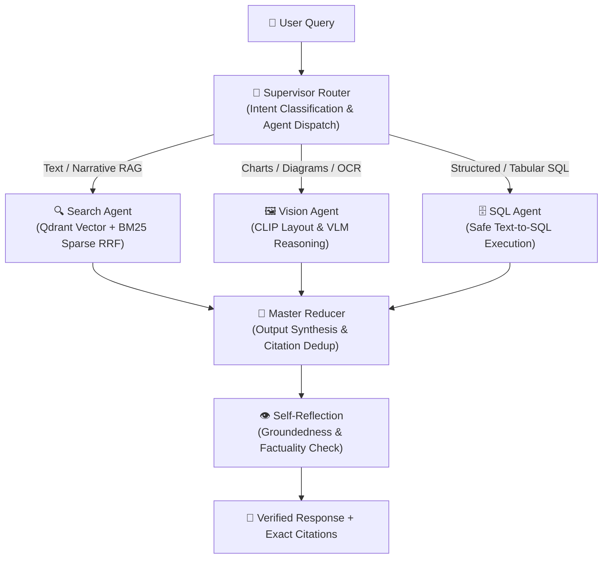
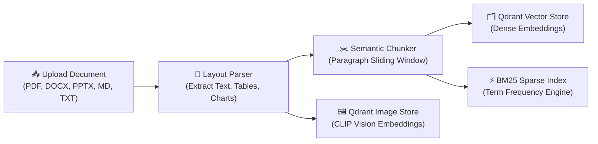

# 🧠 OmniBrain: Enterprise Multi-Agent Multi-Modal RAG Orchestrator

[](https://github.com/Adityacoderrrr/omnibrain)
[](https://langchain-ai.github.io/langgraph/)
[](https://fastapi.tiangolo.com/)
[](https://react.dev/)
[](https://qdrant.tech/)
[](https://www.python.org/)
[](LICENSE)

OmniBrain is a production-grade **Enterprise Multi-Agent Multi-Modal Retrieval-Augmented Generation (RAG) Orchestrator**. It bridges the gap between unstructured multi-format documents (PDFs, Word documents, PowerPoint presentations, Markdown, and text), visual layouts (embedded charts, tables, diagrams), and structured relational databases.

Orchestrated via **LangGraph**, OmniBrain analyzes complex queries through a **Supervisor Router**, dynamically dispatches tasks to specialized domain agents in parallel, fuses findings through a **Master Reducer**, verifies factual accuracy via a **Self-Reflection Node**, and provides real-time **SSE token streaming** and **LangSmith/LangFuse-style execution telemetry**.

---

## 📑 Table of Contents
1. [Core Capabilities](#-core-capabilities)
2. [Architecture & Workflow](#-architecture--workflow)
3. [Component Breakdown](#-component-breakdown)
4. [Technology Stack](#-technology-stack)
5. [API Reference](#-api-reference)
6. [Getting Started](#-getting-started)
7. [Running the Application](#-running-the-application)
8. [Automated Test Suite](#-automated-test-suite)
9. [Verified Capabilities & Roadmap](#-verified-capabilities--roadmap)

---

## 🚀 Core Capabilities

- **LangGraph Multi-Agent StateGraph**: Supervisor router classifies query intent and coordinates specialized worker agents (`Search`, `Vision`, `SQL`) with parallel execution branches and `MemorySaver` session checkpointing.
- **Advanced Hybrid RAG**: Combines dense vector cosine similarity (Qdrant) and sparse keyword frequency (BM25 Okapi) using **Reciprocal Rank Fusion (RRF $k=60$)**, sliding-window context compression, and highlighted snippet extraction.
- **Multi-Format Ingestion Pipeline**: Asynchronous background document parsing for PDF (with layout extraction), Word (`.docx`), PowerPoint (`.pptx`), Markdown (`.md`), and raw text (`.txt`).
- **Safe Text-to-SQL Engine**: Translates natural language questions to read-only SQL, validates queries against AST safety rules (blocking all destructive DDL/DML), executes against relational tables (PostgreSQL or local SQLite schema), and synthesizes plain-English explanations.
- **Master Reducer & Citation Deduplication**: Consolidates multi-agent outputs, resolves contradictory claims, deduplicates citations by `(page, source_type, snippet)`, and calibrates confidence metrics.
- **Self-Reflection & Groundedness Verification**: Evaluates answer groundedness against retrieved context, computes factuality scores, and auto-generates context-aware follow-up questions.
- **Full Observability & Trace Telemetry**: Real-time trace recording capturing step latency, per-node structured inputs/outputs, prompt and completion token counts, and cost estimations.
- **Glassmorphic Enterprise Frontend**: High-end React 18 + Vite SPA styled with Tailwind CSS and Framer Motion, featuring dark mode, SSE real-time streaming, interactive DAG trace inspection, and live observability analytics.

---

## 🏛️ Architecture & Workflow

### 1. High-Level Agentic StateGraph



### 2. Multi-Modal Document Ingestion & Indexing Pipeline



---

## 🧩 Component Breakdown

### 1. Supervisor Node (`agents/supervisor.py`)
- Sanitizes user input and prompts LLM for structured JSON routing decisions.
- Identifies single or multi-agent execution paths with calibrated confidence scores.
- Automatically falls back to safe text search if query is unparseable or empty.

### 2. Search Agent (`agents/search_agent.py`)
- Executes hybrid retrieval combining Qdrant dense vector search with in-memory BM25 Okapi scoring.
- Enforces token window limits using `compress_context_chunks`.
- Synthesizes grounded answers strictly using retrieved context with transparent no-match handling.

### 3. Vision Agent (`agents/vision_agent.py`)
- Searches Qdrant image collections for chart, table, and diagram region embeddings.
- Synthesizes visual answers grounded in extracted layout elements with exact page references.

### 4. SQL Agent (`agents/sql_agent.py`)
- Converts natural language queries into read-only SQL (`SELECT` / `WITH`).
- Validates SQL syntax to block destructive statements (`DROP`, `DELETE`, `UPDATE`, `ALTER`, `TRUNCATE`).
- Executes queries on configured PostgreSQL or in-memory SQLite schema (`sales_records`) and returns plain-English explanations.

### 5. Master Reducer (`agents/reducer.py`)
- Consolidates responses from parallel agents into a unified, non-redundant synthesis.
- Deduplicates citations and calculates aggregate confidence scores.
- Generates context-aware follow-up suggestion chips.

### 6. Self-Reflection Node (`agents/reflection.py`)
- Cross-checks synthesized answers against retrieved source documents.
- Evaluates groundedness scores and flags verification status (`PASSED`, `UNVERIFIED`).

---

## 🛠️ Technology Stack

| Layer | Technologies |
|---|---|
| **Agent Orchestration** | LangGraph, LangChain Core, Python 3.10+ |
| **Backend API** | FastAPI 0.140, Uvicorn, Pydantic v2, Starlette |
| **Vector Database & Search** | Qdrant Client (REST / In-Memory), BM25 Okapi Sparse Search, RRF |
| **Document Ingestion** | PyPDF, PDFPlumber, python-docx, python-pptx |
| **Relational Database** | SQLAlchemy, SQLite, PostgreSQL compatible |
| **Frontend SPA** | React 18, Vite, Tailwind CSS, Framer Motion, Lucide React, Recharts |
| **Observability & Testing** | LangSmith/LangFuse telemetry schema, PyTest, AnyIO, TestClient |

---

## 🔌 API Reference

### Document Ingestion
- `POST /documents/upload` — Asynchronously upload and ingest PDF, DOCX, PPTX, MD, or TXT document.
- `GET /documents` — List all registered uploaded documents with page and chunk metadata.
- `GET /documents/{document_id}/status` — Poll document ingestion status (`received` → `parsing` → `embedding` → `ready`).
- `GET /documents/{document_id}/details` — Get full document inspection metadata and chunk counts.
- `DELETE /documents/{document_id}` — Delete document file and purge vectors from Qdrant and BM25 index.

### Multi-Agent Query & Streaming
- `POST /query` — Run full LangGraph StateGraph orchestration pipeline over target document or SQL database.
- `POST /query/stream` — Real-time Server-Sent Events (SSE) streaming of agent execution steps and token chunks.

### Observability & Tracing
- `GET /tracing` — List recent execution traces with step logs and token analytics.
- `GET /tracing/{request_id}` — Inspect structured telemetry for an individual query execution trace.
- `GET /analytics/overview` — Get platform-wide aggregated query counts, latency percentiles, token usage, and agent distributions.

### Collections & System
- `POST /collections` — Create document grouping collections.
- `GET /collections` — List all document collections.
- `DELETE /collections/{collection_id}` — Delete a collection.
- `GET /health` — Health check endpoint.
- `GET /` — API root index.

---

## 🏁 Getting Started

### 1. Prerequisites
- Python 3.10 or higher
- Node.js 18+ and npm
- (Optional) Qdrant instance or Docker

### 2. Backend Setup
```powershell
# Clone repository
git clone https://github.com/Adityacoderrrr/omnibrain.git
cd omnibrain

# Activate virtual environment
.\.venv\Scripts\Activate.ps1

# Install dependencies (if needed)
pip install -r requirements.txt
```

### 3. Environment Configuration
Create a `.env` file in the project root:
```ini
APP_ENV=development
QDRANT_URL=:memory:
DEFAULT_LLM_MODEL=gpt-4o
OPENAI_API_KEY=mock-key
DATABASE_URL=
UPLOAD_DIR=storage/uploads
```

---

## 🖥️ Running the Application

### 1. Start the FastAPI Backend Server
```powershell
uvicorn app.main:app --host 127.0.0.1 --port 8000 --reload
```
API Documentation will be accessible at: `http://127.0.0.1:8000/docs`

### 2. Start the React + Vite Frontend
```powershell
cd frontend
npm install
npm run dev
```
Access the OmniBrain web interface at: `http://localhost:5173`

---

## 🧪 Automated Test Suite

OmniBrain includes comprehensive unit, integration, and end-to-end regression tests covering agent routing, SQL safety, hybrid RAG, trace recording, and analytics calculation.

Run the test suite with:
```powershell
.\.venv\Scripts\pytest.exe -v
```

### Test Coverage Highlights:
- `test_agents.py`: Supervisor classification, search agent compression, vision agent execution, SQL safety AST verification, reducer synthesis, and checkpointer recovery.
- `test_api_smoke.py`: Root health, 415 format validation, and 404 document routing.
- `test_enterprise_ingestion.py`: Layout parsing, chunking with overlap, and multi-format document parsing.
- `test_enterprise_rag.py`: BM25 term frequency indexing, Reciprocal Rank Fusion (RRF), and keyword snippet highlighting.
- `test_observability.py`: Self-reflection verification and telemetry trace store operations.
- `test_final_e2e_integration.py`: End-to-end real document ingestion, grounded search vs. ungrounded refusal, SQL execution on SQLite schema, and analytics accuracy.

---

## 📊 Verified Capabilities & Roadmap

### Verified & Implemented
- [x] Multi-Agent Supervisor Router with LangGraph StateGraph orchestration.
- [x] Hybrid RAG (Qdrant Dense Vector + BM25 Sparse Keyword with RRF $k=60$).
- [x] Real multi-format ingestion (PDF, DOCX, PPTX, Markdown, TXT).
- [x] Safe text-to-SQL with read-only validation against relational database.
- [x] Master Reducer with multi-agent conflict resolution and citation deduplication.
- [x] Self-reflection answer verification and groundedness scoring.
- [x] Real-time SSE token and step streaming.
- [x] Full observability trace telemetry and analytics endpoints.
- [x] React 18 + Vite frontend with dark/glassmorphic design and interactive DAG visualizer.
- [x] 100% test pass rate across 45 automated test cases.

### Future Roadmap
- [ ] ColPali / ColQwen page-as-image late-interaction retrieval for dense financial charts.
- [ ] Enterprise semantic schema catalog for multi-thousand column data warehouses.
- [ ] Cross-document multi-year comparative financial analysis.
- [ ] Human-in-the-loop checkpoint approval for critical corporate actions.

---

## 📜 License
OmniBrain is licensed under the [MIT License](LICENSE).
